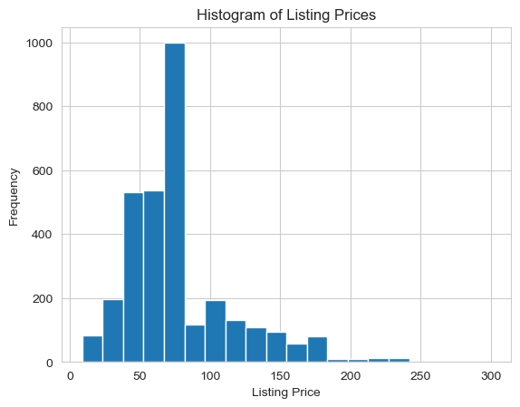
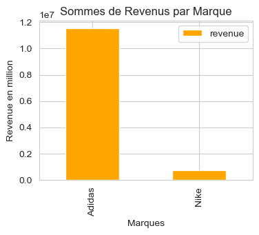
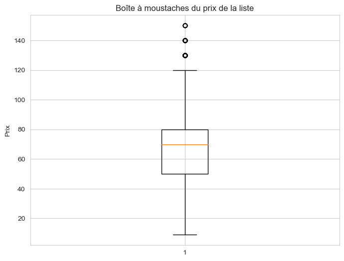
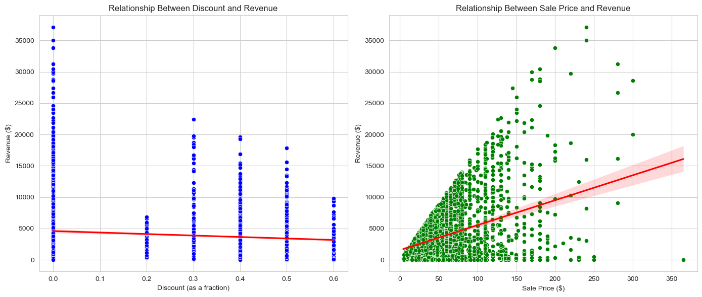
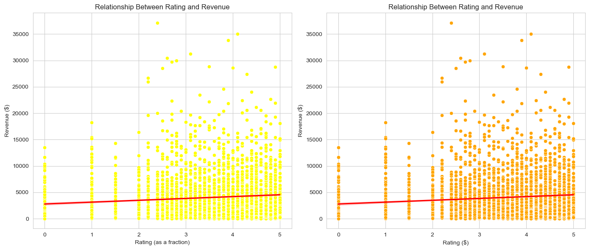

```python
import pandas as pd
import numpy as np
import matplotlib as plt
import seaborn as sns


# Etape 1 : importer les csv puis créer une fusion à partir de la colonne product.id grâce à pd.merge(csv1,csv2, on=product.id)
brands =pd.read_csv('brands.csv')
finance=pd.read_csv('finance.csv')
info=pd.read_csv('info.csv')
reviews=pd.read_csv('reviews.csv')


identifier_col = "product_id"  


#merge qui permet de fusionner les df brands et finance sur la colonne product_id, on nommera cela brands_finance

brands_finance = pd.merge(brands,finance, on = ['product_id'])

#merge qui permet de fusionner les df info et reviews sur la colonne product_id`qui donnera info_reviews

info_reviews = pd.merge(info,reviews, on = ['product_id'])

#On refait un merge qui permet de fusionner les 2 DF fusionner audessus, toujours sur la colonne de jointure

combined_data = pd.merge(brands_finance,info_reviews, on = ['product_id'])

#je supprime la ligne 0 qui affiche que des NaN


combined_data = combined_data.drop(0)

combined_data
```


<div>
<style scoped>
    .dataframe tbody tr th:only-of-type {
        vertical-align: middle;
    }

    .dataframe tbody tr th {
        vertical-align: top;
    }

    .dataframe thead th {
        text-align: right;
    }
</style>
<table border="1" class="dataframe">
  <thead>
    <tr style="text-align: right;">
      <th></th>
      <th>product_id</th>
      <th>brand</th>
      <th>listing_price</th>
      <th>sale_price</th>
      <th>discount</th>
      <th>revenue</th>
      <th>product_name</th>
      <th>description</th>
      <th>rating</th>
      <th>reviews</th>
    </tr>
  </thead>
  <tbody>
    <tr>
      <th>1</th>
      <td>G27341</td>
      <td>Adidas</td>
      <td>75.99</td>
      <td>37.99</td>
      <td>0.5</td>
      <td>1641.17</td>
      <td>Women's adidas Originals Sleek Shoes</td>
      <td>A modern take on adidas sport heritage, tailor...</td>
      <td>3.3</td>
      <td>24.0</td>
    </tr>
    <tr>
      <th>2</th>
      <td>CM0081</td>
      <td>Adidas</td>
      <td>9.99</td>
      <td>5.99</td>
      <td>0.4</td>
      <td>398.93</td>
      <td>Women's adidas Swim Puka Slippers</td>
      <td>These adidas Puka slippers for women's come wi...</td>
      <td>2.6</td>
      <td>37.0</td>
    </tr>
    <tr>
      <th>3</th>
      <td>B44832</td>
      <td>Adidas</td>
      <td>69.99</td>
      <td>34.99</td>
      <td>0.5</td>
      <td>2204.37</td>
      <td>Women's adidas Sport Inspired Questar Ride Shoes</td>
      <td>Inspired by modern tech runners, these women's...</td>
      <td>4.1</td>
      <td>35.0</td>
    </tr>
    <tr>
      <th>4</th>
      <td>D98205</td>
      <td>Adidas</td>
      <td>79.99</td>
      <td>39.99</td>
      <td>0.5</td>
      <td>5182.70</td>
      <td>Women's adidas Originals Taekwondo Shoes</td>
      <td>This design is inspired by vintage Taekwondo s...</td>
      <td>3.5</td>
      <td>72.0</td>
    </tr>
    <tr>
      <th>5</th>
      <td>B75586</td>
      <td>Adidas</td>
      <td>47.99</td>
      <td>19.20</td>
      <td>0.6</td>
      <td>1555.20</td>
      <td>Women's adidas Sport Inspired Duramo Lite 2.0 ...</td>
      <td>Refine your interval training in these women's...</td>
      <td>1.0</td>
      <td>45.0</td>
    </tr>
    <tr>
      <th>...</th>
      <td>...</td>
      <td>...</td>
      <td>...</td>
      <td>...</td>
      <td>...</td>
      <td>...</td>
      <td>...</td>
      <td>...</td>
      <td>...</td>
      <td>...</td>
    </tr>
    <tr>
      <th>3174</th>
      <td>AT6100-606</td>
      <td>Nike</td>
      <td>0.00</td>
      <td>64.95</td>
      <td>0.0</td>
      <td>0.00</td>
      <td>Nike Tiempo Legend 8 Academy TF</td>
      <td>The Nike Tiempo Legend 8 Academy TF takes the ...</td>
      <td>0.0</td>
      <td>0.0</td>
    </tr>
    <tr>
      <th>3175</th>
      <td>CT9155-063</td>
      <td>Nike</td>
      <td>0.00</td>
      <td>139.95</td>
      <td>0.0</td>
      <td>251.91</td>
      <td>Nike React Metcon AMP</td>
      <td>The Nike React Metcon AMP takes the stability ...</td>
      <td>3.0</td>
      <td>1.0</td>
    </tr>
    <tr>
      <th>3176</th>
      <td>CI1236-100</td>
      <td>Nike</td>
      <td>159.95</td>
      <td>127.97</td>
      <td>0.0</td>
      <td>230.35</td>
      <td>Air Jordan 8 Retro</td>
      <td>The Air Jordan 8 Retro recaptures the memorabl...</td>
      <td>5.0</td>
      <td>1.0</td>
    </tr>
    <tr>
      <th>3177</th>
      <td>AH6799-300</td>
      <td>Nike</td>
      <td>0.00</td>
      <td>169.95</td>
      <td>0.0</td>
      <td>1223.64</td>
      <td>Nike Air Max 98</td>
      <td>The Nike Air Max 98 features the OG design lin...</td>
      <td>4.0</td>
      <td>4.0</td>
    </tr>
    <tr>
      <th>3178</th>
      <td>CJ9585-600</td>
      <td>Nike</td>
      <td>89.95</td>
      <td>62.97</td>
      <td>0.0</td>
      <td>0.00</td>
      <td>Nike P-6000 SE</td>
      <td>A mash-up of Pegasus' past, the Nike P-6000 SE...</td>
      <td>0.0</td>
      <td>0.0</td>
    </tr>
  </tbody>
</table>
<p>3178 rows × 10 columns</p>
</div>


```python
#ici j'essaye de drop les outliers, ici il n'y en a qu'un comme on a pu le remarquer sur les graph ( ça peut fausser les data)

# Identifier les index des lignes avec un revenu supérieur ou égal à 60000
indexes_to_drop = combined_data[combined_data['revenue'] >= 60000].index

# Supprimer les lignes correspondantes dans le DataFrame
combined_data.drop(indexes_to_drop, inplace=True)


#OUTLIERS DE LA COLONNE REVENUES
```


```python
# Remove duplicates (assuming all columns)
combined_data.drop_duplicates(inplace=True)
```


```python
count_zero = (combined_data['listing_price']==0).sum()
count_zero
```


    353


```python
filtered_prices = combined_data['listing_price'][combined_data['listing_price'] > 0] 
filtered_prices
```


    1        75.99
    2         9.99
    3        69.99
    4        79.99
    5        47.99
             ...  
    3168    169.95
    3170     89.95
    3172    159.95
    3176    159.95
    3178     89.95
    Name: listing_price, Length: 2766, dtype: float64


```python
median_price = filtered_prices.median() 
median_price
```


    69.99


```python
combined_data['listing_price'].replace(0,median_price, inplace=True)  
combined_data
```


<div>
<style scoped>
    .dataframe tbody tr th:only-of-type {
        vertical-align: middle;
    }

    .dataframe tbody tr th {
        vertical-align: top;
    }

    .dataframe thead th {
        text-align: right;
    }
</style>
<table border="1" class="dataframe">
  <thead>
    <tr style="text-align: right;">
      <th></th>
      <th>product_id</th>
      <th>brand</th>
      <th>listing_price</th>
      <th>sale_price</th>
      <th>discount</th>
      <th>revenue</th>
      <th>product_name</th>
      <th>description</th>
      <th>rating</th>
      <th>reviews</th>
    </tr>
  </thead>
  <tbody>
    <tr>
      <th>1</th>
      <td>G27341</td>
      <td>Adidas</td>
      <td>75.99</td>
      <td>37.99</td>
      <td>0.5</td>
      <td>1641.17</td>
      <td>Women's adidas Originals Sleek Shoes</td>
      <td>A modern take on adidas sport heritage, tailor...</td>
      <td>3.3</td>
      <td>24.0</td>
    </tr>
    <tr>
      <th>2</th>
      <td>CM0081</td>
      <td>Adidas</td>
      <td>9.99</td>
      <td>5.99</td>
      <td>0.4</td>
      <td>398.93</td>
      <td>Women's adidas Swim Puka Slippers</td>
      <td>These adidas Puka slippers for women's come wi...</td>
      <td>2.6</td>
      <td>37.0</td>
    </tr>
    <tr>
      <th>3</th>
      <td>B44832</td>
      <td>Adidas</td>
      <td>69.99</td>
      <td>34.99</td>
      <td>0.5</td>
      <td>2204.37</td>
      <td>Women's adidas Sport Inspired Questar Ride Shoes</td>
      <td>Inspired by modern tech runners, these women's...</td>
      <td>4.1</td>
      <td>35.0</td>
    </tr>
    <tr>
      <th>4</th>
      <td>D98205</td>
      <td>Adidas</td>
      <td>79.99</td>
      <td>39.99</td>
      <td>0.5</td>
      <td>5182.70</td>
      <td>Women's adidas Originals Taekwondo Shoes</td>
      <td>This design is inspired by vintage Taekwondo s...</td>
      <td>3.5</td>
      <td>72.0</td>
    </tr>
    <tr>
      <th>5</th>
      <td>B75586</td>
      <td>Adidas</td>
      <td>47.99</td>
      <td>19.20</td>
      <td>0.6</td>
      <td>1555.20</td>
      <td>Women's adidas Sport Inspired Duramo Lite 2.0 ...</td>
      <td>Refine your interval training in these women's...</td>
      <td>1.0</td>
      <td>45.0</td>
    </tr>
    <tr>
      <th>...</th>
      <td>...</td>
      <td>...</td>
      <td>...</td>
      <td>...</td>
      <td>...</td>
      <td>...</td>
      <td>...</td>
      <td>...</td>
      <td>...</td>
      <td>...</td>
    </tr>
    <tr>
      <th>3174</th>
      <td>AT6100-606</td>
      <td>Nike</td>
      <td>69.99</td>
      <td>64.95</td>
      <td>0.0</td>
      <td>0.00</td>
      <td>Nike Tiempo Legend 8 Academy TF</td>
      <td>The Nike Tiempo Legend 8 Academy TF takes the ...</td>
      <td>0.0</td>
      <td>0.0</td>
    </tr>
    <tr>
      <th>3175</th>
      <td>CT9155-063</td>
      <td>Nike</td>
      <td>69.99</td>
      <td>139.95</td>
      <td>0.0</td>
      <td>251.91</td>
      <td>Nike React Metcon AMP</td>
      <td>The Nike React Metcon AMP takes the stability ...</td>
      <td>3.0</td>
      <td>1.0</td>
    </tr>
    <tr>
      <th>3176</th>
      <td>CI1236-100</td>
      <td>Nike</td>
      <td>159.95</td>
      <td>127.97</td>
      <td>0.0</td>
      <td>230.35</td>
      <td>Air Jordan 8 Retro</td>
      <td>The Air Jordan 8 Retro recaptures the memorabl...</td>
      <td>5.0</td>
      <td>1.0</td>
    </tr>
    <tr>
      <th>3177</th>
      <td>AH6799-300</td>
      <td>Nike</td>
      <td>69.99</td>
      <td>169.95</td>
      <td>0.0</td>
      <td>1223.64</td>
      <td>Nike Air Max 98</td>
      <td>The Nike Air Max 98 features the OG design lin...</td>
      <td>4.0</td>
      <td>4.0</td>
    </tr>
    <tr>
      <th>3178</th>
      <td>CJ9585-600</td>
      <td>Nike</td>
      <td>89.95</td>
      <td>62.97</td>
      <td>0.0</td>
      <td>0.00</td>
      <td>Nike P-6000 SE</td>
      <td>A mash-up of Pegasus' past, the Nike P-6000 SE...</td>
      <td>0.0</td>
      <td>0.0</td>
    </tr>
  </tbody>
</table>
<p>3177 rows × 10 columns</p>
</div>


```python
combined_data['listing_price'].median()
```


    69.99


```python
combined_data['listing_price'].count()
```


    3119


```python
#On utilise la méthode des quartiles afin de savoir les différentes valeurs aberrantes DANS LA COLONNE LISTING PRICE
without_outliers=combined_data[combined_data['listing_price']>=80]


Q1 = without_outliers['listing_price'].quantile(0.25)
Q3 = without_outliers['listing_price'].quantile(0.75)
IQR = Q3 - Q1

lower_bound = Q1 - 1.5 * IQR
upper_bound = Q3 + 1.5 * IQR

outliers = without_outliers[(without_outliers['listing_price'] < lower_bound) | (without_outliers['listing_price'] > upper_bound)]

print("Nombre de valeurs aberrantes :", len(outliers))

```

    Nombre de valeurs aberrantes : 30


```python
# Supprimer les outliers de votre DataFrame
cleaned_data = without_outliers[(without_outliers['listing_price'] >= lower_bound) & (without_outliers['listing_price'] <= upper_bound)]


# Vous pouvez également réinitialiser l'index si vous voulez
cleaned_data.reset_index(drop=True, inplace=True)


```


```python
import matplotlib.pyplot as plt

# Suppose que vous avez déjà importé et fusionné vos données dans combined_data

# Filtrer les prix de liste supérieurs à 0.00
filtered_prices = combined_data['listing_price'][combined_data['listing_price'] > 0.00]

# Calculer la moyenne des prix filtrés
mean_price = filtered_prices.mean()

# Remplacer les valeurs NaN dans la colonne 'listing_price' par la moyenne calculée
combined_data['listing_price'].fillna(mean_price, inplace=True)

# Tracer un histogramme des prix de liste
plt.hist(combined_data['listing_price'], bins=20)  # Utilisez le nombre de bacs souhaité
plt.xlabel('Listing Price')
plt.ylabel('Frequency')
plt.title('Histogram of Listing Prices')
plt.show()

```


    

    


```python
#On va juste créer un objet qui va grouper par marque et aussi calculer la somme des revenues par marque
sum_by_brand = combined_data.groupby('brand')[['revenue']].sum()
sum_by_brand
```


<div>
<style scoped>
    .dataframe tbody tr th:only-of-type {
        vertical-align: middle;
    }

    .dataframe tbody tr th {
        vertical-align: top;
    }

    .dataframe thead th {
        text-align: right;
    }
</style>
<table border="1" class="dataframe">
  <thead>
    <tr style="text-align: right;">
      <th></th>
      <th>revenue</th>
    </tr>
    <tr>
      <th>brand</th>
      <th></th>
    </tr>
  </thead>
  <tbody>
    <tr>
      <th>Adidas</th>
      <td>11526619.08</td>
    </tr>
    <tr>
      <th>Nike</th>
      <td>738079.33</td>
    </tr>
  </tbody>
</table>
</div>


```python
# Tracer un diagramme à barres pour visualiser les sommes de revenus par marque
sum_by_brand.plot(kind='bar', figsize=(4, 3), color='orange')

# Ajouter des labels et un titre
plt.xlabel('Marques')
plt.ylabel('Revenue en million')
plt.title('Sommes de Revenus par Marque')

# Afficher le 
plt.show()
```


    

    


```python
import matplotlib.pyplot as plt

# Suppose que votre DataFrame nettoyé est appelé cleaned_data
plt.figure(figsize=(8, 6))  # Définir la taille de la figure
plt.boxplot(cleaned_data['listing_price'])
plt.ylabel('Prix')  # Ajouter une étiquette à l'axe y
plt.title('Boîte à moustaches du prix de la liste')  # Ajouter un titre
plt.show()

```


    

    


```python
#du coup là tout est bon, il faut juste qu'on sache de ce qu'on vafaire des valeurs aberrantes dans notre colonne
#et faire des tests sur est-ce qu'on supprime les valeurs aberrantes ou bien on garde
#tout dépend de la problématique et du raisonnement que lui donner, dans tous les cas il faudra justifier tout ce qu'on fait 
#mais grosso modo c'est ça 
```


```python
brand_performance = combined_data.groupby('brand').agg({
    'revenue': 'sum',
    'rating': 'mean'}).sort_values(by='revenue', ascending=False)
brand_performance
```


<div>
<style scoped>
    .dataframe tbody tr th:only-of-type {
        vertical-align: middle;
    }

    .dataframe tbody tr th {
        vertical-align: top;
    }

    .dataframe thead th {
        text-align: right;
    }
</style>
<table border="1" class="dataframe">
  <thead>
    <tr style="text-align: right;">
      <th></th>
      <th>revenue</th>
      <th>rating</th>
    </tr>
    <tr>
      <th>brand</th>
      <th></th>
      <th></th>
    </tr>
  </thead>
  <tbody>
    <tr>
      <th>Adidas</th>
      <td>11526619.08</td>
      <td>3.367184</td>
    </tr>
    <tr>
      <th>Nike</th>
      <td>738079.33</td>
      <td>2.783272</td>
    </tr>
  </tbody>
</table>
</div>


```python

# Analyze impact of discounts on revenue
discount_analysis = combined_data.groupby('discount').agg({
    'revenue': ['mean', 'sum'],
    'sale_price': 'mean',
    'reviews': 'sum'
}).sort_values(by=('revenue', 'sum'), ascending=False)

discount_analysis.head()  # Display how different discounts affect revenue

```


<div>
<style scoped>
    .dataframe tbody tr th:only-of-type {
        vertical-align: middle;
    }

    .dataframe tbody tr th {
        vertical-align: top;
    }

    .dataframe thead tr th {
        text-align: left;
    }

    .dataframe thead tr:last-of-type th {
        text-align: right;
    }
</style>
<table border="1" class="dataframe">
  <thead>
    <tr>
      <th></th>
      <th colspan="2" halign="left">revenue</th>
      <th>sale_price</th>
      <th>reviews</th>
    </tr>
    <tr>
      <th></th>
      <th>mean</th>
      <th>sum</th>
      <th>mean</th>
      <th>sum</th>
    </tr>
    <tr>
      <th>discount</th>
      <th></th>
      <th></th>
      <th></th>
      <th></th>
    </tr>
  </thead>
  <tbody>
    <tr>
      <th>0.0</th>
      <td>4495.313308</td>
      <td>5353918.15</td>
      <td>91.698069</td>
      <td>34953.0</td>
    </tr>
    <tr>
      <th>0.5</th>
      <td>3120.243871</td>
      <td>3039117.53</td>
      <td>35.500780</td>
      <td>47739.0</td>
    </tr>
    <tr>
      <th>0.4</th>
      <td>3906.563707</td>
      <td>2929922.78</td>
      <td>44.252400</td>
      <td>36524.0</td>
    </tr>
    <tr>
      <th>0.3</th>
      <td>6206.186354</td>
      <td>595793.89</td>
      <td>67.780625</td>
      <td>4949.0</td>
    </tr>
    <tr>
      <th>0.6</th>
      <td>3154.188000</td>
      <td>189251.28</td>
      <td>35.740000</td>
      <td>2820.0</td>
    </tr>
  </tbody>
</table>
</div>


```python

# Set the aesthetic style of the plots
sns.set_style("whitegrid")

# Create a figure with subplots
fig, ax = plt.subplots(1, 2, figsize=(14, 6))

# Scatter plot for Discount avs Revenue
sns.scatterplot(data=combined_data, x='discount', y='revenue', ax=ax[0], color='blue')
sns.regplot(data=combined_data, x='discount', y='revenue', ax=ax[0], scatter=False, color='red')
ax[0].set_title('Relationship Between Discount and Revenue')
ax[0].set_xlabel('Discount (as a fraction)')
ax[0].set_ylabel('Revenue ($)')

# Scatter plot for Sale Price vs Revenue
sns.scatterplot(data=combined_data, x='sale_price', y='revenue', ax=ax[1], color='green')
sns.regplot(data=combined_data, x='sale_price', y='revenue', ax=ax[1], scatter=False, color='red')
ax[1].set_title('Relationship Between Sale Price and Revenue')
ax[1].set_xlabel('Sale Price ($)')
ax[1].set_ylabel('Revenue ($)')

# Show plot
plt.tight_layout()
plt.show()

```


    

    


```python
# Set the aesthetic style of the plots
sns.set_style("whitegrid")

# Create a figure with subplots
fig, ax = plt.subplots(1, 2, figsize=(14, 6))

# Scatter plot for Discount vs Revenue
sns.scatterplot(data=combined_data, x='rating', y='revenue', ax=ax[0], color='yellow')
sns.regplot(data=combined_data, x='rating', y='revenue', ax=ax[0], scatter=False, color='red')
ax[0].set_title('Relationship Between Rating and Revenue')
ax[0].set_xlabel('Rating (as a fraction)')
ax[0].set_ylabel('Revenue ($)')

# Scatter plot for Sale Price vs Revenue
sns.scatterplot(data=combined_data, x='rating', y='revenue', ax=ax[1], color='orange')
sns.regplot(data=combined_data, x='rating', y='revenue', ax=ax[1], scatter=False, color='red')
ax[1].set_title('Relationship Between Rating and Revenue')
ax[1].set_xlabel('Rating ($)')
ax[1].set_ylabel('Revenue ($)')

# Show plot
plt.tight_layout()
plt.show()
```


    

    

